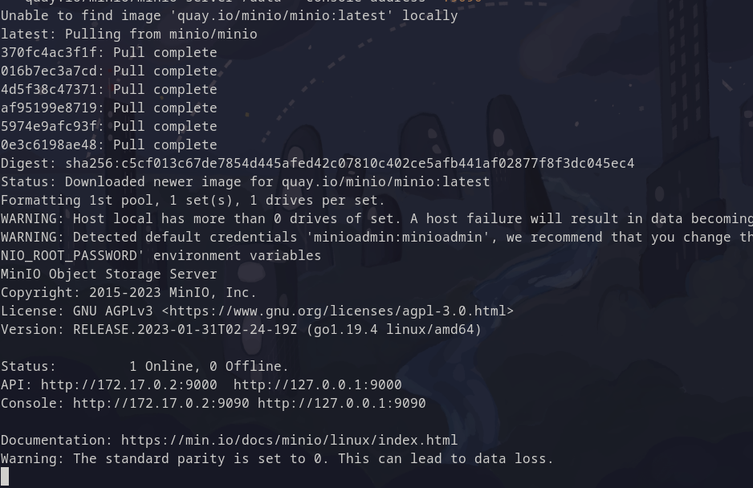
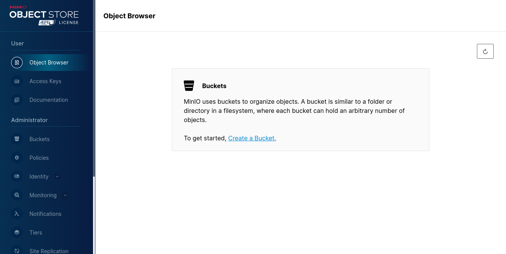
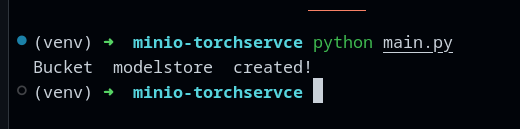
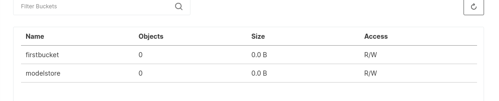
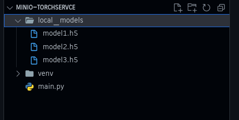
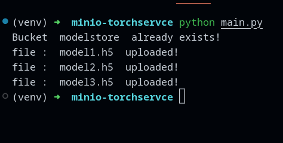
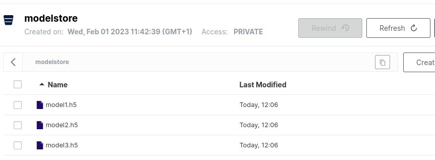

## 1. Installing

`using docker image`

First, check if docker is installed:

```bash
docker version
```

Then create a directory where we gonna store minio data:

```bash
mkdir -p ~/minio/data
```

Then run this command:

```bash
docker run \
   -p 9000:9000 \
   -p 9090:9090 \
   --name minio \
   -v ~/minio/data:/data \
   -e "MINIO_ROOT_USER=minioadmin" \
   -e "MINIO_ROOT_PASSWORD=minioadmin" \
   quay.io/minio/minio server /data --console-address ":9090"
```

You need to get something like this:



Now, let's open the browser on :

```bash
http://127.0.0.1:9090
```



Congratulations !

## 2. S3 Object Storage

## 3. Script to upload & request objects

### 3.1. Create a client server & bucket

First let's intall `minio` client package for python by running:

```bash
pip install minio
```

We can initial our client server and create a bucket using the script below:

```py title="main.py"
from minio import Minio
from minio.error import S3Error

access_key = "yUghEAieytxzlYv3"
secret_key = "S7gkNWccval1rrS3JGbphRVH89Q3sV8x"


class operations:
    def __init__(self, bucket_name, server_play_ground, access_key, secret_key):
        self.bucket_name = bucket_name
        self.server_play_ground = server_play_ground
        self.access_key = access_key
        self.secret_key = secret_key

    def createClientServer(self):
        # create the client server
        client = Minio(
            # server playground for test
            self.server_play_ground,
            access_key=self.access_key,
            secret_key=self.secret_key,
            # just for http connection
            secure=False
        )
        # craete models_store bucket if doesn't exist
        found = client.bucket_exists(self.bucket_name)
        if not found:
            client.make_bucket(self.bucket_name)
            print("Bucket ", self.bucket_name, " created!")
        else:
            print("Bucket ", self.bucket_name, " already exists!")


def main():
    ops = operations(
        bucket_name="modelstore",
        # NOTE: port should be the API port, not the console one
        server_play_ground="127.0.0.1:9000",
        access_key=access_key,
        secret_key=secret_key
    )
    ops.createClientServer()


if __name__ == "__main__":
    try:
        main()
    except S3Error as exp:
        print("error: ", exp)

```

We can see our bucket created in the Minio interface or in the terminal response:





### 3.2. Upload Files to our bucket



We have a set of models in a local directory `local_models`, and we want to upload all those models to our `modelsstore` bucket on minio. Let's add this function ot our `operations` class:

```py title="main.py"
from minio import Minio
from minio.error import S3Error
import os

access_key = "yUghEAieytxzlYv3"
secret_key = "S7gkNWccval1rrS3JGbphRVH89Q3sV8x"


class operations:
    def __init__(self, bucket_name, server_play_ground, access_key, secret_key):
        self.bucket_name = bucket_name
        self.server_play_ground = server_play_ground
        self.access_key = access_key
        self.secret_key = secret_key
        self.client = Minio(
            # server playground for test
            server_play_ground,
            access_key=access_key,
            secret_key=secret_key,
            # just for http connection
            secure=False
        )

    def createClientServer(self):
        # craete models_store bucket if doesn't exist
        found = self.client.bucket_exists(self.bucket_name)
        if not found:
            self.client.make_bucket(self.bucket_name)
            print("Bucket ", self.bucket_name, " created!")
        else:
            print("Bucket ", self.bucket_name, " already exists!")

    def uploadObject(self, local_dir: str):
        for filename in os.listdir(local_dir):
            filepath = os.path.join(local_dir, filename)
            self.client.fput_object(self.bucket_name, filename, filepath)
            print("file : ", filename, " uploaded!")


def main():
    ops = operations(
        bucket_name="modelstore",
        # NOTE: port should be the API port, not the console one
        server_play_ground="127.0.0.1:9000",
        access_key=access_key,
        secret_key=secret_key
    )
    ops.createClientServer()
    ops.uploadObject(
        local_dir="/home/.../minio-torchservce/local_models")


if __name__ == "__main__":
    try:
        main()
    except S3Error as exp:
        print("error: ", exp)

```

And we get:




