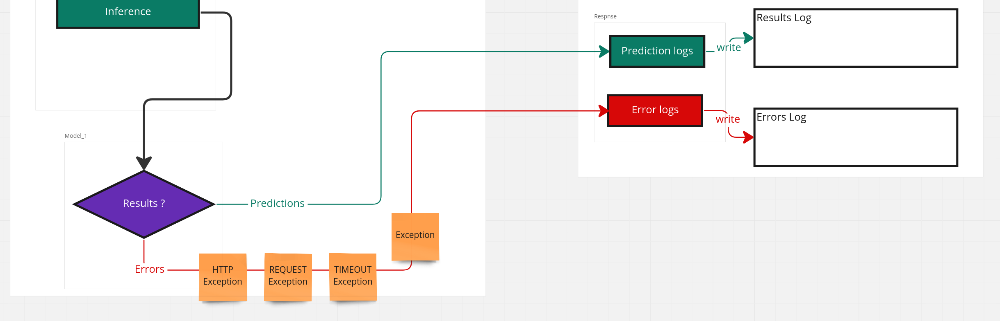

## Requesting Process

In this task, we should implement the process of requesting predictions from our deployed models.
This process should configure how we can send our request, how to implement batches and how to manage different features formats _(images, texts, folders, ...)_

So here we can see the general idea about what should we implement:

:::note Features Operations

You can get more details about how we get our features before send them to our inference [here](../welcome.md)

:::

Our **Inference** in the picture above is part/plugin inside the Engine core component, it's responsible for interacting with our deployed model.

So we gonna work on the follwing sub tasks:

- This package should be able to request predictions from our models via _REST API_.
- Requesting models include sending a `feature by feature` or a `set of features at once` _(to reduce the response time)_
- Our deployed model should be able to interact with features as they are batched, so we gonna improuve the response time.
- Creating a pluging that should be same as an independent package.

### API Calls

As our model are served using `torchserve`, _(check why [here](../welcome.md))_, we are going to interact with our models using **torchserve inference API**. So that's mean we need to request our models via the `http://localhost:8080` as it's the default api for TS Inference.

We are going to use `requests` python package for this step.

### Sending Features

- **one by one**:

  This is the default way using `requests`, while requesting many times would be executed sequentially

- **batch**:

  The best way to improuve the reponse time from the requesting part is to **send requests at once** _simultaneously_. To do that in python, we gonna use the in built package `threading` which gonna allow us to create **Threads**. Those threads gonna be sent independently at one time.

### TS Inference Batching

Supporting batched request is implemented by default in the new versions of `torchserve`. But we should specify that using the **TS Management API** before starting our inference. We have different methods to acheive that: specifying _it in the `config.properties` file_ or _in the post request while serving the model_.

We have two parameters to control the batching process from the TS API side: **batch_size** and **max_batch_delay** _(in ms)_.

The process is as following:

1. While receiving requests, we gonna fill a batch with **batch_size** as a length.
2. This batch should be sent to the `model handler` when: **batch is filled** or **max_batch_delay time's out**
3. Our `model handler` gonna receive a batch of requests.

:::info Model Handler
For more details about how the Model Handler work, please check this part [Model Handler](../welcome.md)
:::

## Exceptions Management

In this part we gonna manage and customize our responses while requesting predictions from our deployed models. We gonna detect specific exceptions and format them in a way to be logged and understood.

In our inference process we would be detecting **three** known exceptions:

- **HTTP Exception**
- **REQUEST Exception**
- **TIMEOUT Exception**

And we added the last one which is **Exception** to handle **unknown exceptions**

## Logging

:::note NOTE
There's a whole component part of the engine responsible on writing what's happening during each request to our inference. This logging _(part of the inference itself)_ is just the beggining of that whole process.
:::

Our purpose here is to log all responses of our requests to the inference api. We divided those logs into two files:

- **access logs**: logging the input and result of all successed requests. It has a level set to `INFO`
- **error logs**: logging all errors from our requests exceptions with the input sent with each request. Error logs level is set to `ERROR`

We also added a third logger to stream what's logged in the file directly in our terminal, we called it `streaming logger`.

## Authorization Management

SOON
