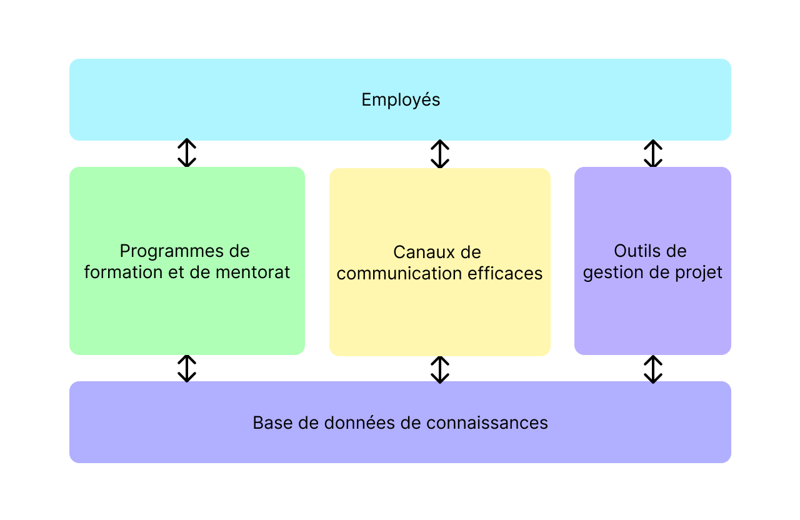

`mobiliser les connaissances pour développer les compétences`

## Projet de Gestion des Risques au sein d'une entreprise aérienne

### 1. Contexte

Le management des connaissances est une approche pour gérer, partager et utiliser l'information et les connaissances au sein d'une entreprise.

Dans le domaine de l'aérien, il est particulièrement important de bien gérer les connaissances, car elles peuvent avoir un impact significatif sur la sécurité et le fonctionnement de l'entreprise.

### 2. Problème identifié

**Comment s'assurer que les employés ont accès aux connaissances et aux informations nécessaires pour prendre des décisions éclairées et gérer efficacement les risques?**

Dans un environnement aérien complexe et en constante évolution, il est important que les employés aient accès à des informations à jour et exactes afin de pouvoir identifier et gérer les risques de manière efficace.

Voici quelques exemples de risques pour une entreprise aérienne en cas de manque de management des connaissances:

- **Perte de connaissances**: lorsque les employés quittent l'entreprise ou changent de poste, ils emportent souvent avec eux des connaissances précieuses et uniques. Si ces connaissances ne sont pas correctement documentées et partagées, il peut y avoir une perte importante de savoir-faire et d'expertise au sein de l'entreprise, ce qui peut entraîner des retards, des erreurs et une baisse de la qualité des services.
- **Problèmes de communication et de collaboration**: si les employés ne disposent pas d'un système pour partager les connaissances et les informations au sein de l'entreprise, il peut y avoir des problèmes de communication et de collaboration qui peuvent ralentir le travail et entraîner des inefficacités.
- **Difficulté à s'adapter aux changements**: sans un management adéquat des connaissances, il peut être difficile pour l'entreprise de s'adapter aux changements et de rester compétitive dans le marché. Cela peut entraîner une perte de clients et une baisse de la rentabilité de l'entreprise.
- **Risques pour la sécurité**: dans le domaine de l'aérien, la sécurité est une préoccupation majeure. Si les employés ne disposent pas des connaissances et des informations nécessaires pour prendre des décisions éclairées et gérer efficacement les risques, cela peut entraîner des incidents et des accidents qui mettent en danger la vie des passagers et de l'équipage.

:::note NB

Ce ne sont là que quelques exemples de risques pour une entreprise aérienne en cas de manque de management des connaissances. Il y a de nombreux autres risques potentiels qui dépendent de la situation spécifique de l'entreprise.

:::

### 3. Une plateforme de KM adaptée

Une solution courante pour lutter contre les problèmes de management des connaissances dans les entreprises aériennes est la mise en place d'une plateforme de gestion des connaissances (KM). Cette plateforme peut être un outil en ligne ou une application qui permet de centraliser et de partager les connaissances et les informations au sein de l'entreprise.

Voici quelques exemples de fonctionnalités que pourrait inclure une plateforme de KM pour les entreprises aériennes:

- **Base de données de connaissances**: cette base de données permet de stocker et de partager les connaissances et les informations importantes au sein de l'entreprise. Elle peut inclure des documents, des fichiers, des vidéos ou tout autre type de support pouvant être utile aux employés.
- **Programmes de formation et de mentorat**: la plateforme peut offrir des programmes de formation en ligne ou des opportunités de mentorat pour aider les employés à acquérir de nouvelles connaissances et compétences.
- **Canaux de communication efficaces**: la plateforme peut mettre en place des canaux de communication pour faciliter la transmission des connaissances et des informations au sein de l'entreprise. Cela peut inclure des forums de discussion, des chats en direct, des groupes de travail ou tout autre moyen permettant aux employés de partager leurs connaissances et de poser des questions à leurs collègues.
- **Outils de gestion de projet**: la plateforme peut inclure des outils pour aider les employés à gérer leurs tâches et leurs projets de manière efficace. Cela peut inclure des calendriers, des listes de tâches, des outils de suivi des performances, etc.

Voici un schéma simple qui illustre les principaux composants d'une plateforme de gestion des connaissances (KM) pour une entreprise aérienne:

Dans ce schéma, la base de données de connaissances est le centre de la plateforme de KM. Elle contient toutes les connaissances et les informations importantes pour l'entreprise, que les employés peuvent accéder et partager via différents canaux de communication. Les programmes de formation et de mentorat aident les employés à acquérir de nouvelles connaissances et compétences, tandis que les outils de gestion de projet leur permettent de gérer efficacement leurs tâches et leurs projets.

En utilisant une plateforme de KM, les entreprises aériennes peuvent s'assurer que les connaissances et les informations sont facilement _accessibles_ et _partagées au sein de l'entreprise_, ce qui peut contribuer à **améliorer la qualité des services**, à **réduire les erreurs et les retards**, et à **favoriser l'innovation et l'efficacité**.
