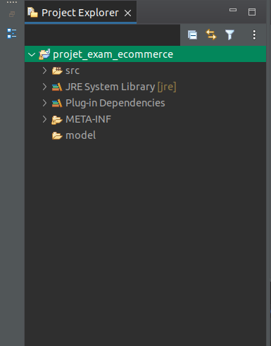
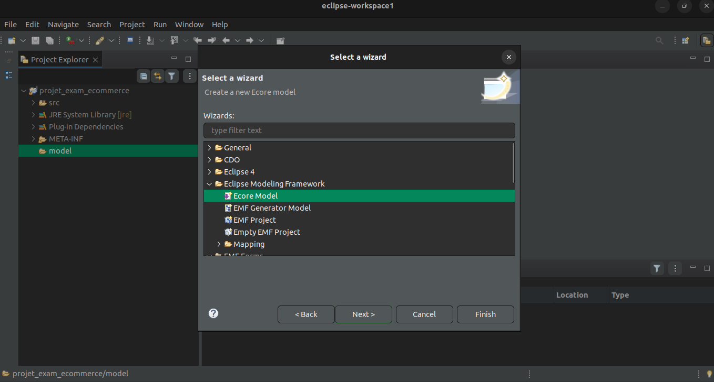

## Sujet de projet

Vous trouverez le support de sujet sur [Ce Lient](https://firebasestorage.googleapis.com/v0/b/jina-pro.appspot.com/o/jina-blog%2Fpdfs%2FExam%20Projet%20IDM%202022-2023.pdf?alt=media&token=ba667965-225f-4c54-adfb-52e397eeeaed)

## 1. Spécification et modélisation du domaine

### 1.1. Les Concepts

Le domaine sera autour de l'ecommerce, et les 3 concepts choisis sont:

- Customer
- Product
- Order

### 1.2. Les Attributs

| Customer           | Product              | Order                |
| ------------------ | -------------------- | -------------------- |
| id (int)           | id (int)             | id (int)             |
| full_name (string) | title (string)       | number (int)         |
| email (string)     | description (string) | date (datetime)      |
| phone (string)     | price (float)        | products (Product[]) |
| address (string)   | category (string)    |                      |
| orders (Order[])   |                      |                      |

### 1.3. Les Relations

- Customer -> Order (1 -> N)
- Order -> Product (N -> N)

### 1.4. Le Modèle ECORE

Pour la modélisation du domaine, j'ai utilisé le logiciel EMF (Eclipse Modeling Framework) qui permet de créer des modèles à partir de la norme Ecore, qui seront ensuite utilisés par les outils de génération de code JAVA.

## 2. Création des Formulaires

## 3. Génération du code JAVA (M2T)
