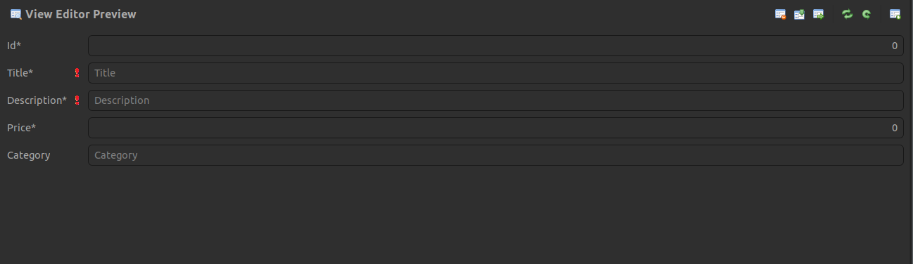

## Sujet de projet

Vous trouverez le support de sujet sur [Ce Lien](https://firebasestorage.googleapis.com/v0/b/jina-pro.appspot.com/o/jina-blog%2Fpdfs%2FExam%20Projet%20IDM%202022-2023.pdf?alt=media&token=ba667965-225f-4c54-adfb-52e397eeeaed)

## 1. Spécification et modélisation du domaine

### 1.1. Les Concepts

Le domaine sera autour de l'ecommerce, et les 3 concepts choisis sont:

- Customer
- Product
- Order

### 1.2. Les Attributs

| Customer           | Product              | Order                |
| ------------------ | -------------------- | -------------------- |
| id (int)           | id (int)             | id (int)             |
| full_name (string) | title (string)       | number (int)         |
| gender (enum)      |                      |                      |
| email (string)     | description (string) | date (datetime)      |
| phone (string)     | price (float)        | products (Product[]) |
| address (string)   | category (string)    |                      |
| orders (Order[])   |                      |                      |

### 1.3. Les Relations

- Customer -> Order (0 -> \*)
- Order -> Product (1 -> \*)

### 1.4. Le Modèle ECORE

Pour la modélisation du domaine, j'ai utilisé le logiciel EMF (Eclipse Modeling Framework) qui permet de créer des modèles à partir de la norme Ecore, qui seront ensuite utilisés par les outils de génération de code JAVA.


On peut voir nos 3 EClasses _(Customer, Order, Product)_ et leurs attributs et relations sur la capture d'écran ci-dessus.


## 2. Création des Formulaires

Après qu'on a suivit ce [Tutorial](https://www.google.com/search?q=Eclipse+EMF+forms&sxsrf=ALiCzsYQugUT98hdEx1m19IkUSAhc_T_Ng%3A1671983693778&ei=TXKoY6aVL4KZkdUPyOW1iAI&ved=0ahUKEwjm74zRkJX8AhWCTKQEHchyDSEQ4dUDCA8&uact=5&oq=Eclipse+EMF+forms&gs_lcp=Cgxnd3Mtd2l6LXNlcnAQAzIICAAQgAQQywE6BwgjELADECc6CggAEEcQ1gQQsAM6BAgjECc6CAgAEBYQHhAPOgkIABAWEB4Q8QQ6CwgAEBYQHhDxBBAKOgYIABAWEB5KBAhBGABKBAhGGABQiA1YyhZg9iJoA3ABeACAAe4BiAH5CJIBBTAuNS4xmAEAoAEByAEKwAEB&sclient=gws-wiz-serp#fpstate=ive&vld=cid:440191e9,vid:DQjIU4FYhpU) sur youtube, on a pu créer des formulaires pour les 3 EClasses.

### 2.1. Formulaire Product



### 2.2. Formulaire Order


### 2.3. Formulaire Customer


## 3. Génération du code JAVA (M2T)

To Generate Java code from our models, we will be using **Acceleo**.

### 3.1. Installation

We can install Acceleo from the Eclipse Marketplace. For this project we will be using Acceleo 3.7.0.

### 3.2. Configuration

On va configurer un fichier `.mtl` qui va contenir les instructions de génération de code JAVA à partir de notre modèle ECORE.

:::note Langage Acceleo

Acceleo utilise un langage spécifique qui s'appelle MTL (Modelling Transformation Language). Ce langage est basé sur le langage OCL (Object Constraint Language) et permet de définir des règles de transformation de modèles.

:::

```mtl title="generate.mtl"
[comment encoding = UTF-8 /]
[module generate('http://www.eclipse.org/emf/2002/Ecore')]


[template public generateElement(anEClass : EClass)]
[comment @main/]
[file (anEClass.name + '.java', false, 'UTF-8')]
public class [anEClass.name/]{
 [GenerarVariablesGlobales(anEClass)/]
 public [anEClass.name/]()
 {
 }
 [GenerarGetSet(anEClass)/]
}
[/file]
[/template]

[comment Generar Variables Globales de la Clase/]
[template public GenerarVariablesGlobales(anEclass: EClass)]
[for(atribut: EAttribute | anEclass.eAttributes) separator('\n')]
private [atribut.eType.name/] [atribut.name/];
[/for]
[/template]

[comment Generar Métodos Get/Set de la Clase/]
[template public GenerarGetSet(anEclass: EClass)]
[for(atributo: EAttribute | anEclass.eAttributes) separator('\n')]
public [atributo.eType.name/] get[atributo.name.toUpperFirst()/](){
 return this.[atributo.name/];
}
[/for]
[for(atributo: EAttribute | anEclass.eAttributes) separator('\n')]
public void set[atributo.name.toUpperFirst()/]([atributo.eType.name/] [atributo.name/]){
 this.[atributo.name/]=[atributo.name/];
}
[/for]
[/template]
```

### 3.3. Génération du code

On démarrera le script de génération de code en cliquant sur le bouton `Run As` puis `Acceleo Application`.


On cherche notre model qui se termine par `.ecore` et on choisit la distination `tasks` du code généré.

On peut voir le code généré dans le dossier `tasks`:


## 4. Code Source de l'application

Vous pouvez télécharger le code source du projet sur mon [Github](https://github.com/AhmedCoolProjects/project-emf-3aci-gdc)
