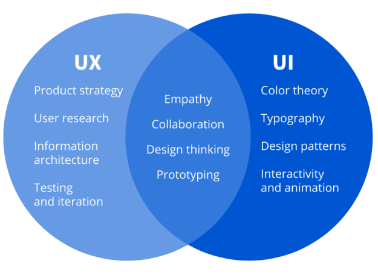

## UX

Qualité de l'expérience vécue par l'utilisateur. _(UX = Business Goals + User Needs)_

_Tim Brown_ propose un schéma pour le Design Thinking:

- **Désirabilité**: centré sur l'utilisateur
- **Faisabilité technique**: est-ce que c'est possible?
- **Viabilité économique**: est-ce que c'est rentable?

- **UI**: design + frontend _(Produit)_
- **UX**: recherche + prototypage _(Produit + Utilisation)_

## Pourquoi UX?

- **Accélérer Time to Market** _(MVP, Design Sprint, Lean UX, Design Thinking)_.
- **Ne pas s'arreter dès la première idée** _(Brainstorming: Personas, Empathy Map, Six to One, Cartes "Et Si", Customer Journey)_.
- **Comprendre l'utilsateur** _(répondre à son besoin)_
- **Trouver l'équilibre: UX vs Objectifs Commerciaux**
- **Fidéliser les clients** _(Guest Checkout)_
- **test d'utilisabilité** _(5 -> 85% problèmes révélés, 15 -> 100%, 0 -> 0 insights)_

### Design thinking

- **Entrer en Empathie** -> **Définir** -> **Imaginer** -> **Prototyper** -> **Tester**

### Lean UX

- **Empathie** -> **Créativité** -> **Rationalité**

### Etapes

1. **Idéation - entrer en empathie** -> **Idéation - Six to One**

   - **Empathy Map** -> _ENTEND_, _VOIT_, _PENSE / RESSENT_, _DIT / FAIT_ -> Problèmes + Besoins
   - capacité de mise à la place de l'utilisateur -> retranscrire les besoins, les motivations, les actions attendues.
   - Profile Persona -> mettre à coté ses croyances pour bien cerner le besoin _(Représentation fictive des utilisateurs finaux)_
   - **Six to One** -> brainstorming visuel _(Organisation d'Information)_ -> 6 idées -> 1 idée
   - **six-up** -> dissiner plusieurs solutions -> éviter l'arret sur la première idée.
   - _Brief_ -> _Divergence_ -> _Partage_ -> _Convergence_ -> _Synthèse_

2. **Prototypage**

   - raconte une histoir, se projeter dans la solution -> affiner et valider l'hypothèse
   - **prototype papier**: _conception_, penser rapidement à l'organisation de l'information
   - **Zoning**: décrire les grandes zones, en amont
   - **wireframes** _(maquette de fil de fer)_: zones, composants sous forme de **croquis**, pas d'importance pour les choix esthétiques, plus d'importance aux choix structurels et de fonctionnalités, `dessiner à la main` balsamic - mockingbird
   - **mockups**: evidence, design du produit final, esthétique, **pricis** + **réaliste**
   - **Prototype Interactif**: parcours utilisateurs, plus fidèle pour le produit final
   - Balsamic Mockup, Powerpoint, Oversite, Gliffy, Justinmind, FlairBuilder, Axure, Omnigraffle

3. **Testr**:

   - feedback -> améliorations
   - 5 users -> révéler 85% des problèmes
   - Guerilla Testing, HEART, A/B Testing, AttrakDiff

## IA / UX / Utilisabilité

- l'IA: `information architectrue` simplifie l'interaction et l'utilisation de l'information.
- Utilisabilité: degré d'utilisation par des utilisateurs spécifiques.
